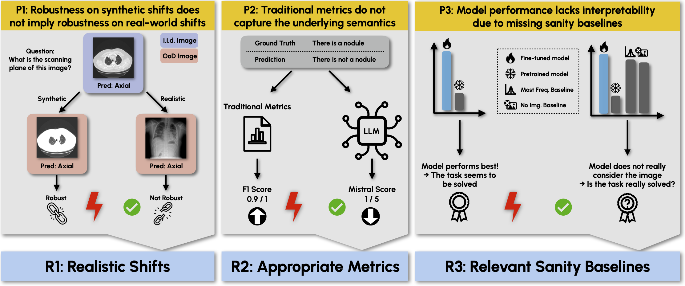

# SURE-VQA: SYSTEMATIC UNDERSTANDING OF ROBUSTNESS EVALUATION IN MEDICAL VQA TASKS

> Vision-Language Models (VLMs) have great potential in medical tasks, like Visual Question Answering (VQA), where they could act as interactive assistants for both patients and clinicians. Yet their robustness to distribution shifts on unseen data remains a critical concern for safe deployment. Evaluating such robustness requires a controlled experimental setup that allows for systematic insights into the model’s behavior. However, we demonstrate that current setups fail to offer sufficiently thorough evaluations, limiting their ability to accurately assess model robustness. To address this gap, our work introduces a novel framework, called SURE-VQA, centered around three key requirements to overcome the current pitfalls and systematically analyze the robustness of VLMs: 1) Since robustness on synthetic shifts does not necessarily translate to real-world shifts, robustness should be measured on real-world shifts that are inherent to the VQA data; 2) Traditional token-matching metrics often fail to capture underlying semantics, necessitating the use of large language models (LLMs) for more accurate semantic evaluation; 3) Model performance often lacks interpretability due to missing sanity baselines, thus meaningful baselines should be reported that allow assessing the multimodal impact on the VLM. To demonstrate the relevance of this framework, we conduct a study on the robustness of various Parameter-Efficient Fine-Tuning (PEFT) methods across three medical datasets with fourdifferent types of distribution shifts. Our study reveals several important findings:
>1) Sanity baselines that do not utilize image data can perform surprisingly well
>2) We confirm LoRA as the best-performing PEFT method
>3) No PEFT method consistently outperforms others in terms of robustness to shifts.


## Table of Contents

- [Install](#install)
- [Model Download](#model-download)
- [Data Download](#data-download)
- [Finetuning](#finetune)
- [Inference](#inference)
- [Evaluation](#evaluation)
- [Acknowledgement](#acknowledgement)

<a name="install"></a>
## Install

<a name="model_download"></a>
## Model Download

<a name="data_download"></a>
## Data Download

<a name="finetune"></a>
## Finetuning

<a name="inference"></a>
## Inference

<a name="evaluation"></a>
## Evaluation

<a name="acknowledgement"></a>
## Acknowledgement
<!-- To enable the gpt4 evaluation functionality in this repo you need to have an API key from Openai.

To get an API key please go to the following webpage: https://platform.openai.com/docs/overview

After getting a key, you need to add this key to the .env file in your repository. The file, *template.env*, is created for you as a guide which shows how your .env file should look like. You can copy the context of this file to your .env file or basically change the file name to .env by removing the template part. Note that the repository will not run properly if you don't set all the parameters spesified in this file.

You can add your API key to the following variable in the .env file:

```shell
export OPEN_AI_API_KEY= your_api_key
```

Once you have set your key you need to run the following before starting the program.

```shell
source .env 
``` -->

## Setting up OVQA Dataset
- change the train, val and test set names as test.json train.json validate.json
